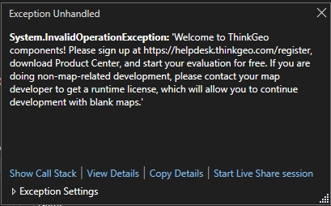

This guide will demonstrate how to register for a ThinkGeo account, download and install the Production Center, and activate your ThinkGeo products.

# ThinkGeo Production Center: Manage all ThinkGeo Products Licenses

### Step 1: Run the Sample & Register for Your Free Evaluation

The first time you run your application, two things happen at the same time. One is that if you have not install a license, you may encounter a 'licenses not installed' exception. 

The other is that you will be directed to ThinkGeo's registration website. There, you can create an account to begin a 30-day free evaluation, and you can find instructions for downloading and installing the Production Center, as well as information on how to manage all licenses for ThinkGeo products from within the [Production Center](https://cloud.thinkgeo.com/clients.html). 

Once you activate the 'ThinkGeo UI WPF' license to start your evaluation, you should be able to see the map with our Cloud Maps layer! You can zoom in on the maps in several ways, including double-clicking the left mouse key, using the mouse wheel, or selecting an area to zoom in on. You can also rotate the maps by pressing "Alt + mouse left key."

### Step 2: Download and install ThinkGeo Production Center

Now that you have a basic setup, you can add custom data to the map. Depending on the data, this can be complex or quite simple. We'll be going over the simple basics of adding custom data, with a pitfall or two to help you better understand how our framework can help you get around these issues.

Download the [WorldCapitals.zip](https://gitlab.com/thinkgeo/public/thinkgeo-desktop-maps/-/tree/master/assets/WorldCapitals.zip) shapefile data and unzip it in your project under a new folder called `AppData`. Make sure that the files are set to copy to the build output directory. From there, we can add the shapefile to the map.

