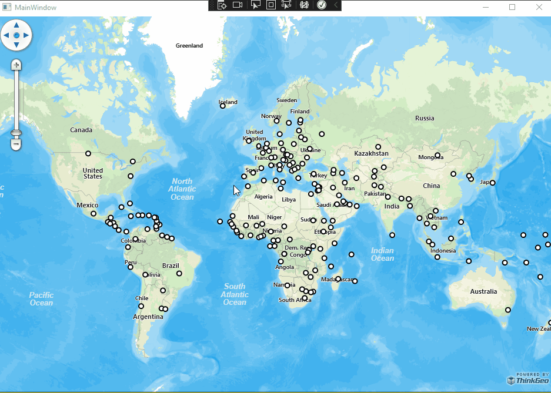
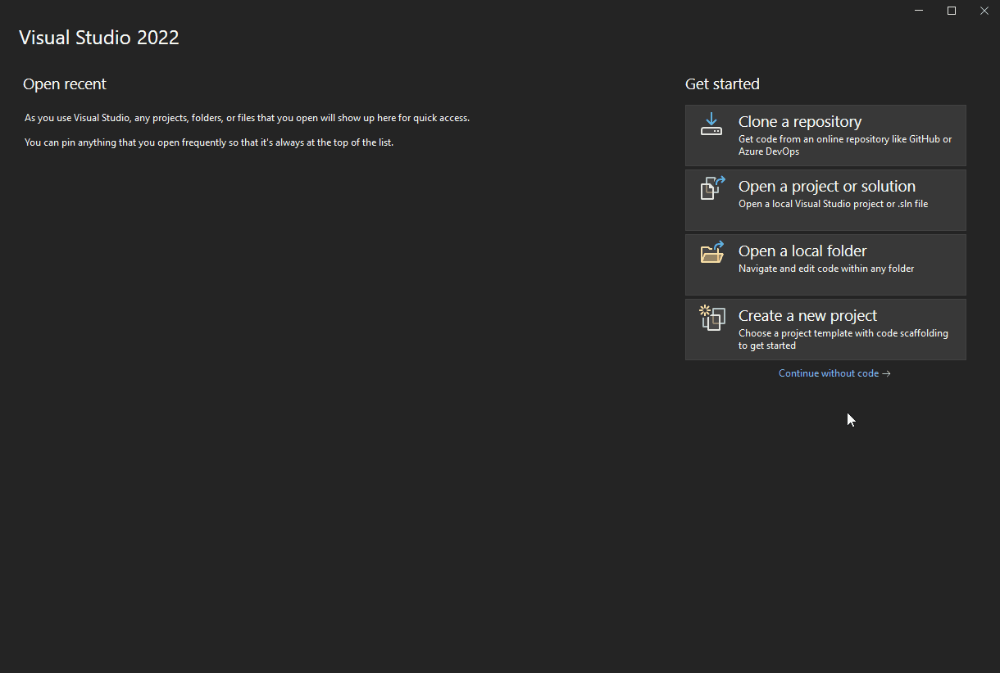
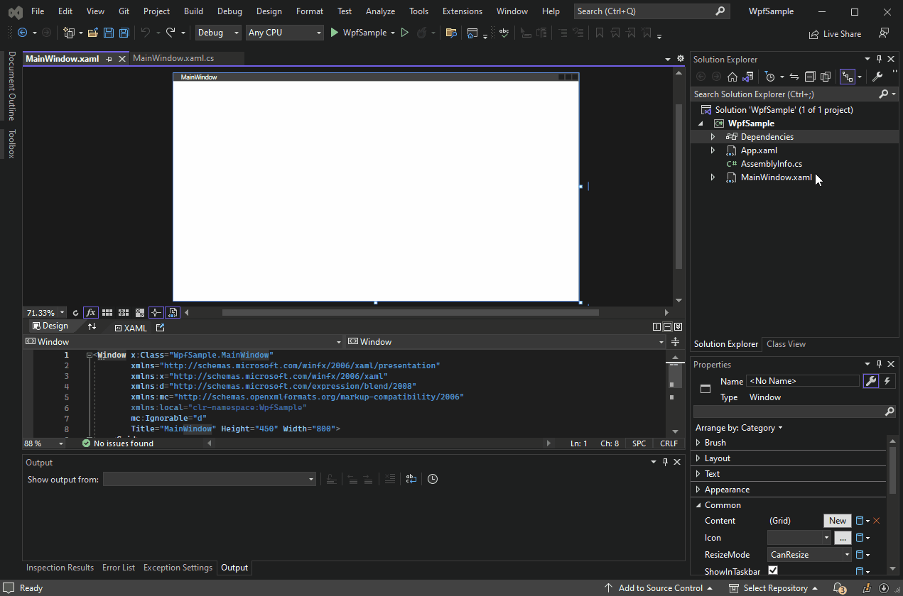

This guide is based on using Visual Studio 2022. However, with some minor adjustments, you can create a map using other IDEs like JetBrains Rider or VS Code as well.

The project created in this guide is developed in .NET 7, but you can also create a .NET Framework project using practically the same steps.

# Desktop Maps Quick Start: Display a Simple Map using WPF

In this section, we'll show you how to create a visually appealing map with external data and styling. We highly recommend that you also take a look at the [How Do I Sample](https://gitlab.com/thinkgeo/public/thinkgeo-desktop-maps/-/tree/master/samples/wpf/HowDoISample), which contains numerous examples that cover virtually everything you can do with the control.

First, to begin working on the map, you'll need to create a .NET WPF project using Visual Studio 2022. Once that's done, we'll guide you through the process of adding the required packages and getting the map set up on the default form. Next, we'll show you how to add a background and a shapefile to the map, and also how to customize it with labels and styles.



### Step 1: Create a WPF Project
Create a C# WPF project with the Framework .NET 7.0. 

 

### Step 2: Add Nuget Packages: 

Install **ThinkGeo.UI.Wpf** NuGet package through NuGet package manager



### Step 3: Add the Map Control to `MainWindow.xaml`

Add ThinkGeo.UI.Wpf namespace to `MainWindow.xaml` 

```xml
xmlns:uc1="clr-namespace:ThinkGeo.UI.Wpf;assembly=ThinkGeo.UI.Wpf"
```

Add the map control within `Grid` element in `MainWindow.xaml` file.

```xml
<uc1:MapView x:Name="mapView" Loaded="mapView_Loaded" MapUnit="Meter"></uc1:MapView>
```
### Step 4: Add the ThinkGeo Background
Import the namespace at the top of 'MainWindow.xaml.cs` file.

```csharp
using ThinkGeo.Core;
```


Add the following code to the mapView_Loaded event, which is triggered when the map view is fully loaded and ready to use. (The key passed in ThinkGeoCloudVectorMapsOverlay is for test only, you can apply for your own key from [ThinkGeo Cloud](https://cloud.thinkgeo.com/clients.html))


```csharp
// Add a base map overlay.
var cloudVectorBaseMapOverlay = new ThinkGeoCloudVectorMapsOverlay("USlbIyO5uIMja2y0qoM21RRM6NBXUad4hjK3NBD6pD0~", "f6OJsvCDDzmccnevX55nL7nXpPDXXKANe5cN6czVjCH0s8jhpCH-2A~~", ThinkGeoCloudVectorMapsMapType.Light);
mapView.Overlays.Add(cloudVectorBaseMapOverlay);
mapView.CurrentExtent = MaxExtents.ThinkGeoMaps;
```

### Step 5: Run the Sample & Register for Your Free Evaluation

The first time you run your application, you will be presented with ThinkGeo's Product Center which will create and manage your licenses for all of ThinkGeo's products.
If not it will show licenses not installed Exception.


Create a new account to begin a 60-day free evaluation.

1. Run the application in Debug mode.
1. Click the "Create a new Account?" link.
1. Fill out your name, email address, password and company name and click register.
1. Check your email and click the "Active Your Account" link.
1. Return to Product Center and login using the credentials your just created and hit "Continue Debugging" button.

You should now see your map with our Cloud Maps layer!

### Step 7: Add a Point Data Layer in the map

Now that you have a basic setup, you can add custom data to the map. Depending on the data, this can be complex or quite simple. We'll be going over the simple basics of adding custom data, with a pitfall or two to help you better understand how our framework can help you get around these issues.

Download the [WorldCapitals.zip](https://gitlab.com/thinkgeo/public/thinkgeo-desktop-maps/-/tree/master/assets/WorldCapitals.zip) shapefile data and unzip it in your project under a new folder called `AppData`. Make sure that the files are set to copy to the build output directory. From there, we can add the shapefile to the map.

```csharp
            // Add a shapefile layer with point style.
            var capitalLayer = new ShapeFileFeatureLayer(@"./AppData/WorldCapitals.shp");
            var capitalStyle = new PointStyle()
            {
                SymbolType = PointSymbolType.Circle,
                SymbolSize = 8,
                FillBrush = new GeoSolidBrush(GeoColors.White),
                OutlinePen = new GeoPen(GeoColors.Black, 2)
            };
            capitalLayer.ZoomLevelSet.ZoomLevel01.DefaultPointStyle = capitalStyle;
            capitalLayer.ZoomLevelSet.ZoomLevel01.ApplyUntilZoomLevel = ApplyUntilZoomLevel.Level20;
            // Set the projection of the capitalLayer to Spherical Mercator
            capitalLayer.FeatureSource.ProjectionConverter = new ProjectionConverter(4326, 3857);

            // Create an overlay to add the layer to and add that overlay to the map.
            var customDataOverlay = new LayerOverlay();
            customDataOverlay.Layers.Add(capitalLayer);
            mapView.Overlays.Add(customDataOverlay);
            
            mapView.Refresh(); 
```
Now, the data shows up properly on the map!

## Summary

You now know the basics of using the ThinkGeo Map controls and are able to get started adding functionality into your own applications. Let's recap what we have learned about the object relationships and how the pieces of ThinkGeo UI work together:

1. It is of the utmost importance that the units (feet, meters, decimal degrees, etc.) be set properly for the Map control based on the data.
1. FeatureLayers provide the data used by a Map control to render a map.
1. A Map is the basic control that contains all of the other objects that are used to tell how the map is to be rendered.
1. A Map has many layers. A Layer correlates one-to-one with a single data source and typically of one type (point, polygon, line etc).
1. A FeatureLayer can have several ZoomLevels. ZoomLevels help to define ranges (upper and lower) of when a Layer should be shown or hidden.

You are now in a great position to look over the [How Do I Sample](https://gitlab.com/thinkgeo/public/thinkgeo-desktop-maps/-/tree/master/samples/wpf/HowDoISample) and explore our other features.
